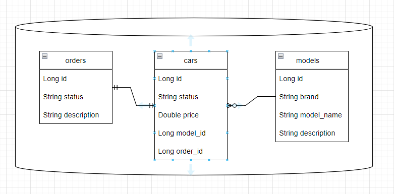

Всего 3 модуля:
* car-showroom
* factory
* common

Эндпоинты - rest, между сервисами - kafka

Схема БД

Основные сценарии:
***
* При вызове метода createNewModel из CarController сохраняется машина (назначается id),
id пересылается на сервис factory, там по нему создается order и возвращается его 
  order_id, который проставлятся в созданный car, после чего он возвращается пользователю
* При вызове методов assembleCar и deliverCar из OrderController обновляется статус заказа,
а так же статус автомобиля в другом сервисе, обращаясь к нему по kafka
