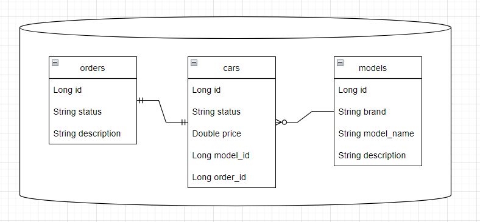

### Проект представляет собой систему управления компанией по производству и продаже автомобилей

---
Состоит из 3 модулей:

* **car-showroom** - микросервис, отвечающий за продажу автомобилей различных марок

* **factory** - микросервис, отвечающий за формирование заказов на автомобили, их производство и отправку в шоурум
* **common** - модуль, содержащий общие ресурсы для остальных микросервисов и миграции БД

Обращение к сервисам происходит по http,Связь между сервисами - путем публикования сообщений в Kafka

---

### Схема БД

---

### Сценарии межсервисного взаимодействия:

* При вызове метода CarController.orderNewCar сохраняется машина (назначается id), id и description пересылается на
  сервис factory, там по нему создается новый order
* При вызове методов OrderController.assembleCarById и OrderController.deliverCarById обновляется статус заказа, а так
  же статус автомобиля в другом сервисе, публикуя сообщение в топике Kafka
